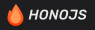
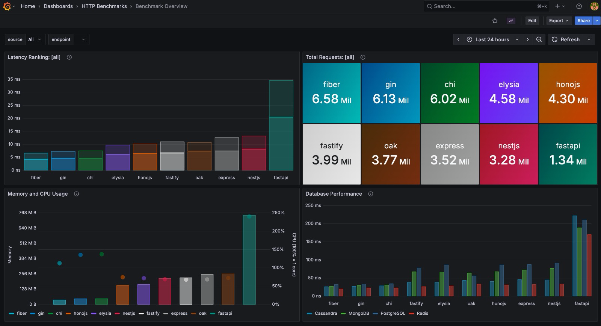

<div align="center">
  
  <p>
    Side-by-side benchmarks. Same API.<br/> 
    Real databases. No toy endpoints.
  </p>

<p align="center">
  
  
  
  
  
  
  
  
  
  
  
  
  <a href="./servers/ts-express"></a>
  <a href="./servers/ts-fastify"></a>
  <a href="./servers/ts-nestjs"></a>
  <a href="./servers/ts-bun-honojs"></a>
  <a href="./servers/ts-bun-elysia"></a>
  <a href="./servers/ts-deno-oak"></a>
  <a href="./servers/go-chi"></a>
  <a href="./servers/go-gin"></a>
  <a href="./servers/go-fiber"></a>
  <a href="./servers/py-fastapi"></a>
</p>
</div>

## Results (200 Concurrency, 5s per endpoint) 📊



## Stack Map 📦

| Folder                  | Runtime       | Framework       | Port  |
| ----------------------- | ------------- | --------------- | ----- |
| `benchmark`             | Go 1.27rc1    | -               | -     |
| `servers/ts-express`    | Node 26.4.0   | Express 5.2.1   | 3001  |
| `servers/ts-nestjs`     | Node 26.4.0   | NestJS 11.1.27  | 3002  |
| `servers/ts-fastify`    | Node 26.4.0   | Fastify 5.9.0   | 3003  |
| `servers/ts-deno-oak`   | Deno 2.9.1    | Oak 17.2.0      | 3004  |
| `servers/ts-bun-honojs` | Bun 1.3.14    | Hono 4.12.27    | 3005  |
| `servers/ts-bun-elysia` | Bun 1.3.14    | Elysia 1.4.29   | 3006  |
| `servers/go-chi`        | Go 1.27rc1    | Chi 5.3.0       | 5001  |
| `servers/go-gin`        | Go 1.27rc1    | Gin 1.12.0      | 5002  |
| `servers/go-fiber`      | Go 1.27rc1    | Fiber 3.4.0     | 5003  |
| `servers/py-fastapi`    | Python 3.14.6 | FastAPI >=0.128 | 4001  |
| `servers/zig`           | Zig 0.16      | http.zig        | 26001 |

### Pinned dependencies 📌

Deliberate prerelease pins (PLAN §10), exempt from the blanket `just update`
bump; each tracks the newest release of its dist-tag channel via
`scripts/update.mts`, never the stable `latest` line:

| Package       | Pinned at    | Channel | Why                                               |
| ------------- | ------------ | ------- | ------------------------------------------------- |
| `typescript`  | `7.0.1-rc`   | `rc`    | TypeScript 7 native `tsc` (`latest` is still 6.x) |
| `drizzle-orm` | `1.0.0-rc.4` | `rc`    | drizzle 1.0 RC (`latest` is still 0.45.x)         |

Held back: `bson` is pinned to `7.2.0` for the whole workspace via
`pnpm-workspace.yaml` `overrides`. bson 7.3.x calls
`v8.startupSnapshot.isBuildingSnapshot()` at import time, which Bun 1.3.14
ships as a throwing stub (`NotImplementedError`), crashing the server on boot.
Since PR #26 mongodb is a single shared dependency (`@bench/shared`), and pnpm
resolves one bson version for every consumer (overrides are graph-path scoped,
not per-member), so the Node servers pin to 7.2.0 too — pnpm cannot scope an
override to just the Bun members. 7.2.0 sits inside mongodb's own `^7.2.0`
range; drop the override once Bun implements the stub.

NestJS dev mode tradeoff: under TS7 `nest start --watch` is gone, so
`ts-nestjs`'s `dev` compiles with `tsc` then runs `node --watch dist/main.js`.
That restarts the server on rebuild but does not watch-recompile sources — edit,
re-run `tsc` (or `just dev ts-nestjs`) to pick up changes.

## Quick Start 🚀

```sh
just benchmark                # Run benchmark (interactive mode)
just benchmark --servers=a,b  # Run benchmark for specific servers only
just dev ts-bun-honojs        # Start dev server (ts-bun-honojs, ts-express, go-chi, etc.)
```

> First `pnpm install` over a checkout that predates the pnpm workspace can want
> to purge the old top-level `node_modules`. `pnpm-workspace.yaml` sets
> `confirmModulesPurge: false`, so the install proceeds non-interactively (no
> `CI=true` or TTY needed) instead of aborting with `ERR_PNPM_ABORTED_REMOVE_MODULES_DIR_NO_TTY`.

## Configuration ⚙️

| Variable | Default       | Description                              |
| -------- | ------------- | ---------------------------------------- |
| `ENV`    | `dev`         | `dev` enables logger, `prod` disables it |
| `HOST`   | `0.0.0.0`     | IP or `localhost` (mapped to `0.0.0.0`)  |
| `PORT`   | See Stack Map | Server port                              |

Benchmark config is JSON-only and lives at `config/config.json`.

## API Surface 🌐

### Base Routes

| Method | Route     | Response              |
| ------ | --------- | --------------------- |
| GET    | `/`       | `{ "hello": "world"}` |
| GET    | `/health` | `OK` (text/plain)     |

### Params Routes (`/params/*`)

| Method | Route              | Description                                                                              |
| ------ | ------------------ | ---------------------------------------------------------------------------------------- |
| GET    | `/params/search`   | Query `q` (trim, default `none`) and `limit` (safe int, default 10)                      |
| GET    | `/params/url/:val` | Returns `{ "dynamic": "<val>" }`                                                         |
| GET    | `/params/header`   | Reads `X-Custom-Header` (trim, default `none`)                                           |
| POST   | `/params/body`     | Validates JSON object (no array/null), returns `{ "body": <parsed> }`                    |
| GET    | `/params/cookie`   | Reads cookie `foo` (trim, default `none`), sets cookie `bar`                             |
| POST   | `/params/form`     | Supports urlencoded/multipart, returns `{ "name": "<trim>", "age": <int> }`              |
| POST   | `/params/file`     | Multipart `file` (max 1MB, text/plain only), returns `{ "filename", "size", "content" }` |

### Database Routes (`/db/{database}/*`)

Supported databases: `postgres`, `mongodb`, `redis`, `cassandra`

| Method | Route                       | Description                                                |
| ------ | --------------------------- | ---------------------------------------------------------- |
| GET    | `/db/{database}/health`     | Database health check                                      |
| POST   | `/db/{database}/users`      | Create user `{ "name", "email", "favoriteNumber?" }` (201) |
| GET    | `/db/{database}/users/{id}` | Get user by ID (200 or 404)                                |
| PATCH  | `/db/{database}/users/{id}` | Update user fields (200 or 404)                            |
| DELETE | `/db/{database}/users/{id}` | Delete user by ID (200 or 404)                             |
| DELETE | `/db/{database}/users`      | Delete all users (200)                                     |
| DELETE | `/db/{database}/reset`      | Reset database (200)                                       |

## Error Responses ⚠️

All errors return JSON `{ "error": "<message>" }`.

| Status | Messages                                                                                               |
| ------ | ------------------------------------------------------------------------------------------------------ |
| 400    | `invalid JSON body`, `invalid form data`, `invalid multipart form data`, `file not found in form data` |
| 404    | `not found`                                                                                            |
| 413    | `file size exceeds limit`                                                                              |
| 415    | `only text/plain files are allowed`, `file does not look like plain text`                              |
| 500    | `internal error`                                                                                       |

## Databases 🗄️

All servers connect to all 4 databases with the same user schema.

| Database   | ID Type           |
| ---------- | ----------------- |
| PostgreSQL | UUID v7           |
| MongoDB    | ObjectId (native) |
| Redis      | UUID v7           |
| Cassandra  | UUID v7           |

**User schema:** `id`, `name`, `email`, `favoriteNumber` (optional)

## Grafana 📊

Metrics are exported to InfluxDB and visualized in Grafana during benchmarks.

| Service | URL                   | Username | Password |
| ------- | --------------------- | -------- | -------- |
| Grafana | http://localhost:3000 | admin    | 123456   |

### Exported Metrics

| Measurement             | Fields                                                     | Tags                                        |
| ----------------------- | ---------------------------------------------------------- | ------------------------------------------- |
| `request_latency`       | latency_ns, server_offset_ms, endpoint_offset_ms           | run_id, server, endpoint, method            |
| `sequence_latency`      | total_duration_ns, server_offset_ms, sequence_offset_ms    | run_id, server, sequence_id, database       |
| `sequence_step_latency` | latency_ns, server_offset_ms                               | run_id, server, sequence_id, database, step |
| `resource_stats`        | memory_min/avg/max_bytes, cpu_min/avg/max_percent, samples | run_id, server, source, database (DB only)  |

## Development 🛠️

### Per-Target Commands

All verification commands accept an optional target (default: `all`).

```sh
just typecheck go-chi        # Type check only go-chi
just fmt ts-bun-honojs       # Format only ts-bun-honojs
just lint py-fastapi         # Lint only py-fastapi
just verify ts-express       # Full verification for ts-express
```

Valid targets: `ts-express`, `ts-nestjs`, `ts-fastify`, `ts-deno-oak`, `ts-bun-honojs`, `ts-bun-elysia`, `go-chi`, `go-gin`, `go-fiber`, `py-fastapi`, `zig`, `benchmark`, `root` (the `servers/*/bench.json` `name` fields, plus `benchmark` and `root`)

### Full Command Reference

```sh
just benchmark           # Run benchmark (interactive mode)
just install             # Install all dependencies
just typecheck           # Type/compile check all projects
just fmt                 # Format all code
just lint                # Lint all code
just verify              # Non-mutating gate: typecheck -> format-check -> lint
just images              # Build all Docker images
just clean               # Remove build artifacts and node_modules
just remove-images       # Remove Docker images
just grafana-up          # Start Grafana/InfluxDB stack
just grafana-down        # Stop Grafana/InfluxDB stack
just db-up               # Start database stack
just db-down             # Stop database stack
```
